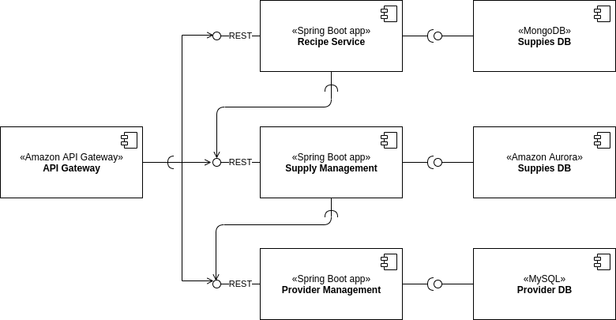

# Resturant System
**Version 0.0.1**  

This is a purely educational purpose project, and also let me show my work in a more realistic way within a heterogeneous tech stack.
Why a restauran system? It's easy, I love cooking.

The project aims to build a system for management and planning activities of a restaurant.

## Scope
In this version, we'll deliver the required components for designing and costing recipes.

The following diagram shows a initial blueprint:

*This diagram will be updated as the project moves*

## How will this project be built?
First it all, all development activities will be guided through **TDD**, **CI**, and **incremental design**.

Regarding the technological stack, we'll use the following:

- Spring Boot
  - Spring Test
  - Spring Data JPA (with Hibernate)
  - Spring Data MongoDB
  - Spring MVC (for REST APIs)
  - Spring Validation (Bean Validation with Hibernate validator)
- Spring Cloud
  - Externalized Configuration
  - Service registration and discovery
  - Circuit Breakers
- Continuous Integration
  - Jenkins
  - GitHub Actions 
- AWS
  - Amazon RDS for MySQL
  - Amazon Aurora
  - MongoDB
  - Amazon API Gateway
  - Amazon ECS

*This technological stack will be updated as the project moves* 

## Modules

- Provider Management (current development)
